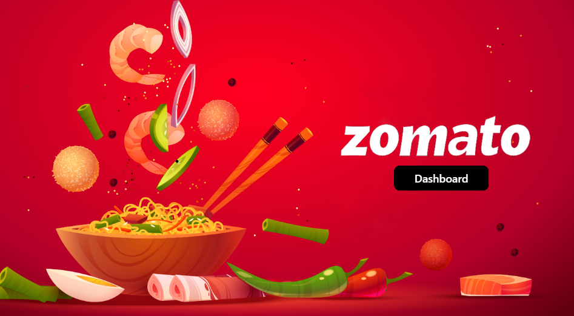
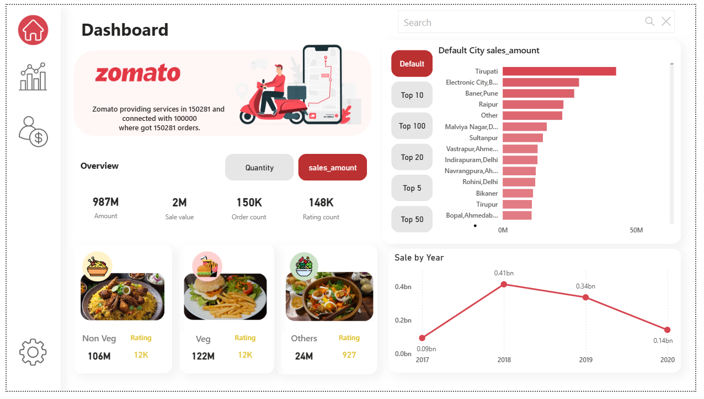
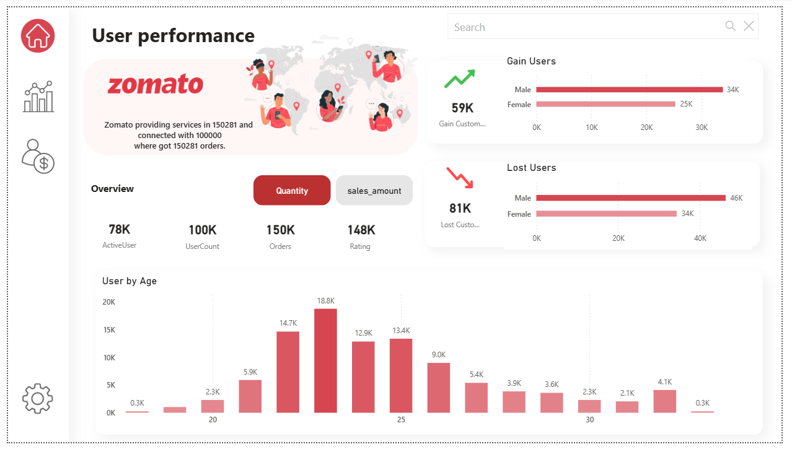
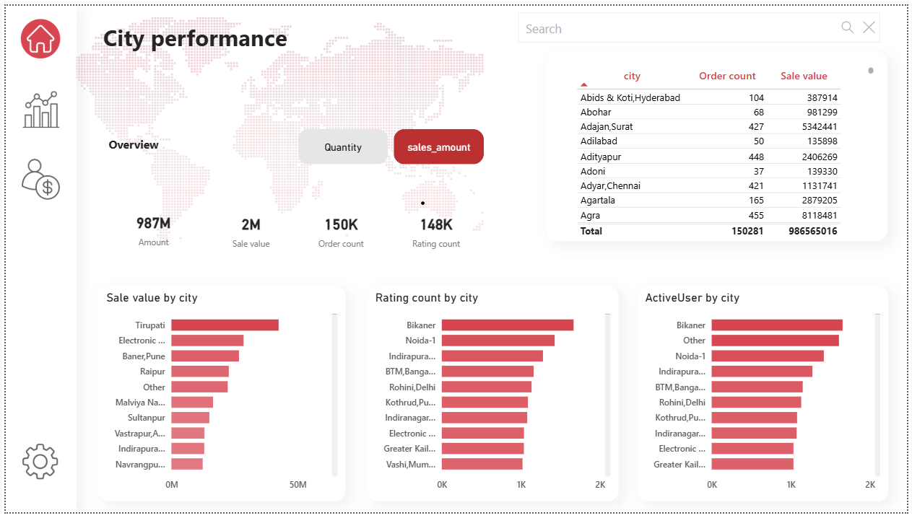

# Zomato-performance-Dashboard

Welcome to my Zomato performance Dashboard project! This repository houses an interactive Power BI dashboard that dives deep into the world of food delivery, analyzing a rich dataset to uncover trends, user behaviors, and business insights. Built with passion and curiosity, this dashboard is designed to be both functional and visually engaging, making it a great tool for anyone interested in food tech analytics.

Overview

This dashboard leverages data from Zomato's extensive operations, covering:

100,000+ users with detailed demographics (age, gender, occupation).

150,281 cities where Zomato operates, with a focus on India.

150,282 orders tracked with sales quantities, amounts, and food types (Veg, Non-Veg, Other).

Key highlights from the data include:

A strong lean toward Veg food items, generating 122M INR in sales compared to 106M INR for Non-Veg.

A noticeable decline in total sales from 0.41bn INR in 2018 to 0.14bn INR in 2020, suggesting potential market shifts.

A youthful user base, peaking between 18-24 years, with more male users in both gains (34K) and losses (46K).

Top-performing cities like Tirupati and Electronic City leading in sales and user activity.

Features

User Performance: Tracks active users, order counts, and demographic breakdowns.

Sales Trends: Visualizes sales by year, city, and food type with interactive filters.

City Performance: Highlights top cities by sales value, order count, and active users.

The dashboard is built using Power BI, offering a user-friendly interface with dynamic visualizations to explore the data at your own pace.

Screenshots

1. Start Page

The welcoming start page sets the tone with an overview of Zomato's reach and a vibrant design to draw you in.

2. User Performance

This section breaks down user gains and losses by gender, age distribution, and key metrics like active users and orders.

3. City Performance

Explore how different cities perform with detailed views on sales value, order counts, and active users across the network.

How to Use

Clone the Repository: Download or clone this repo to your local machine.

Open in Power BI: Use Microsoft Power BI Desktop to open the .pbix file (coming soon – stay tuned!).

Explore the Data: Interact with filters and visuals to dive into the insights that matter to you.

Customize: Feel free to tweak the dashboard or add your own data sources.

Data Sources

The dashboard is powered by the following datasets (included in this repo):

users.xlsx: User demographics (age, gender, occupation).

orders.xlsx: Order details (date, quantity, sales amount).

orders_Type.xlsx: Order types (Veg, Non-Veg, Other).

food.xlsx: Food item catalog.

menu.xlsx: Menu details (cuisine, price).

Getting Started

To get the most out of this project, you’ll need Power BI Desktop installed. If you don’t have it yet, download it from the official Microsoft site. Once installed, open the .pbix file, and you’re ready to explore!

Contributions

I’d love for this to grow! If you have suggestions, bug reports, or want to contribute enhancements, please open an issue or submit a pull request. Collaboration is key, and I’m excited to see where this can go with your input.

Feedback

Have thoughts or questions? Drop a comment here or reach out directly. I’m eager to hear how this dashboard helps you or how it can be improved. Let’s make data storytelling even better together!

Happy analyzing! 🍽️
